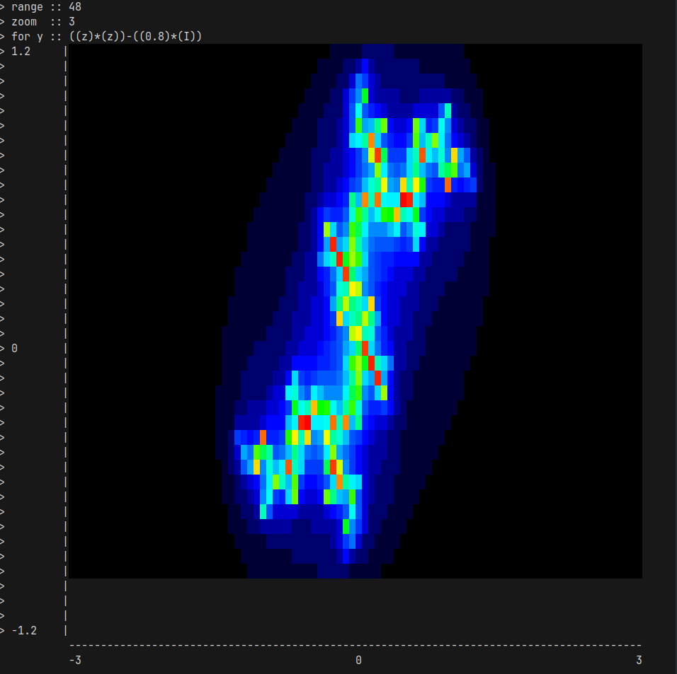

# Calc Interpreter

A calculator for my journey as an embedded system engineer.
Manipulate physics units and orders of magnetude with ease.



## Installation

This is very straight forward. Clone the repository and run make.

```bash
git clone git@github.com:BolvicBolvicovic/calc.git
cd calc
make
```

It will compile and launch the interpreter by default.
The only requirements are the libmath and libreadline which should be installed by default and a gcc compiler.

## Usage

I have written an extensive documentation [here](./mkdocs/docs/documentation.md).
Note that you can build and read it from your browser at [localhost:8000/documentation](http://localhost:8000/documentation).

```bash
make docs_serve
```

## Testing

Run `make tests`.
It will create and run two binaries: one in debug mode, one optimize.

## Upcomming features

Upcomming features and ideas are documented [here](./mkdocs/docs/index.md).
You can also access it from your browser at [localhost:8000](http://localhost:8000).
